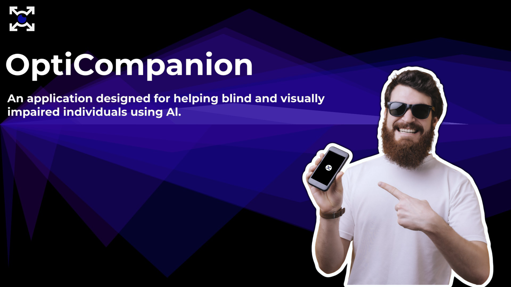
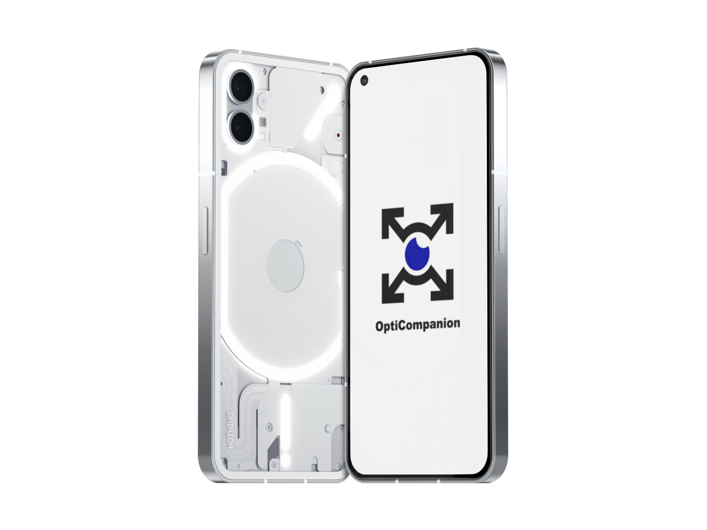
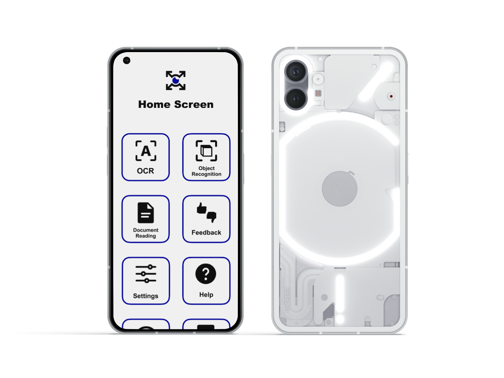

<div align="center">


<h1 style="vertical-align: top; font-size: 5em; text-decoration: none;">OptiCompanion</h1>
<br>

</div>

A Flutter + TensorFlow Lite mobile app that assists blind and visually impaired people by recognizing objects in real time and reading digital documents out loud. The app ships with bilingual UI and voice support (English and Arabic).



---

## Table of contents

-   **[What is OptiCompanion?](#what-is-opticompanion)**
-   **[Core features](#core-features)**
-   **[Platforms and languages](#platforms-and-languages)**
-   **[Getting started](#getting-started)**
-   **[How to use (gestures)](#how-to-use-gestures)**
-   **[Demo](#demo)**
-   **[Design](#design)**
-   **[Models (TensorFlow Lite)](#models-tensorflow-lite)**
-   **[Dependencies](#dependencies)**
-   **[Future Work](#future-work)**
-   **[References](#references)**
-   **[Author](#author)**
-   **[License](#license)**

---

## What is OptiCompanion?

OptiCompanion is a mobile accessibility companion designed for blind and visually impaired people that combines on‑device computer vision with high‑quality text‑to‑speech.

-   **Object Recognition**: Uses a TensorFlow Lite model to identify common objects from the device camera and announces the top detections.
-   **Document Reading**: Opens PDFs/eBooks, extracts text, and reads it using a configurable TTS engine.
-   **Accessibility built‑in**: High‑contrast UI, large hit targets, swipe/long‑press interaction, clear fonts and colors, and feedback for users.
-   **Arabic support**: UI labels and voice prompts available in Arabic; detected objects are translated and spoken in Arabic when selected.
-   **Offline-first**: Models and fonts are bundled; works without connectivity after install.

<div align="center">

</div>

---

## Core features

-   **Real‑time object recognition**: SSD MobileNet model via `tflite_v2` with camera streaming and left‑to‑right announcement of detected objects.
-   **Document reader (PDF)**: Pick a PDF, extract its text on device using `syncfusion_flutter_pdf`, and have it read aloud.
-   **Optical Character Recognition (OCR)**: Uses a TensorFlow Lite model to recognize text from the device camera and announces the text (To be implemented in the future).
-   **Text‑to‑Speech**: Powered by `flutter_tts` with adjustable language, pitch and rate.

Other functions and sections (see [pages](./lib/pages/)): Settings, Help, Get in Touch, Welcome/Onboarding, Feedback (To be implemented in the future), and History (To be implemented in the future).

<div align="center">

</div>

---

## Platforms and languages

-   **Platforms**: Built with Flutter, currently focused on Android. The project includes iOS, Web, Windows, Linux and macOS scaffolding (To be implemented in the future).
-   **Languages**: English and Arabic (RTL aware). The app can speak using `en-GB` or `ar` TTS voices depending on selection.

---

## Getting started

You can either download the latest from releases or build from source.

-   Download the latest release (Currently Beta):

    -   **Download from Releases**: Go to the [Releases page](https://gitlab.com/Momad-Y/opticompanion/-/releases), select the latest release (preferred), and download the package from the Packages section.

    -   **Installation**: Extract the downloaded ZIP file and install the APK file on your Android device

-   Build from source

    1. Prerequisites

        - Flutter SDK (>= 3.3), Dart SDK (>= 3.3.0)
        - Android Studio or VS Code with Flutter extensions

    2. Clone the repository

        ```bash
        git clone https://gitlab.com/Momad-Y/opticompanion.git
        ```

    3. Navigate to the project directory

        ```bash
        cd opticompanion
        ```

    4. Install dependencies

        ```bash
        flutter pub get
        ```

    5. Run the app

        ```bash
        flutter run -d android
        ```

Permissions

-   Camera access is required for object recognition and OCR.

---

## How to use (gestures)

The UI is optimized for screen‑reading and large, simple gestures:

-   **Swipe left/right**: Move focus across on‑screen options
-   **Double‑tap**: Focus/announce the selected item
-   **Long‑press**: Activate the selected item (e.g., open Object Recognition, pick a document, toggle actions)

The app announces the currently focused element using the selected TTS language.

---

## Demo

-   **Full Video Demo**: [Click here](https://drive.google.com/file/d/1a4f_4hxvooQ_2g2wvsASdeOO2xyfgdIv/view?usp=drive_link)

Animated preview of the app running:

<div align="center">

</div>

---

## Design

The app is designed using Figma, you can explore the UI system, components, and flows:

-   Figma design file: [Click here](https://www.figma.com/design/AONn8En86f2XBEiVYcZZVb/OptiCompanion?node-id=0-1&t=1OmEkeHUrGJo8G8r-1)

---

## Models (TensorFlow Lite)

Models are bundled under `assets/models/` and declared in `pubspec.yaml`.

-   `ssd_mobilenet.tflite` + `labels.txt`
    -   Used for real‑time object detection in the Object Recognition page
    -   Inference via `Tflite.detectObjectOnFrame` (model: "SSDMobileNet").
-   `ocr.tflite` and `east-text-detector.tflite`
    -   Included for future OCR capabilities. The current implementation focuses on PDF text extraction; end‑to‑end camera OCR is planned.

The object recognition pipeline throttles frames for efficiency, orders detections from left‑to‑right, and reads results aloud in the chosen language.

---

## Dependencies

Key packages from [pubspec.yaml](./pubspec.yaml) and what they do:

-   `camera` — stream frames from the device camera for model inference
-   `tflite_v2` — load TFLite models and run on‑device inference
-   `flutter_tts` — text‑to‑speech for English and Arabic
-   `syncfusion_flutter_pdf` — parse PDFs and extract text on device
-   `file_picker` — pick local files (PDFs, eBooks)
-   `shared_preferences` — persist lightweight settings (planned usage)
-   `url_launcher` — open external links from Help/Get in touch
-   `cupertino_icons` — iOS-styled icons

Fonts: `Arial` family is bundled in `assets/fonts/` for consistent typography.

---

## Future Work

-   Camera‑based OCR using bundled TFLite OCR models
-   Expanded document formats (ePub/Docx)
-   On‑device settings persistence and accessibility presets
-   iOS beta

---

## References

-   Flutter: https://flutter.dev/
-   TensorFlow Lite: https://www.tensorflow.org/lite
-   SSD MobileNet (COCO): https://www.kaggle.com/models/tensorflow/ssd-mobilenet-v1
-   flutter_tts: https://pub.dev/packages/flutter_tts
-   tflite_v2: https://pub.dev/packages/tflite_v2
-   camera: https://pub.dev/packages/camera
-   syncfusion_flutter_pdf: https://pub.dev/packages/syncfusion_flutter_pdf
-   file_picker: https://pub.dev/packages/file_picker

---

## Author

-   Mohamed Youssef Abdelnasser | [LinkedIn](https://www.linkedin.com/in/Mohamed-y-Abdelnasser) | [Gitlab](https://gitlab.com/Momad-Y)

## License

This project is licensed under the Apache License 2.0. See the [LICENSE](LICENSE) file for details.
